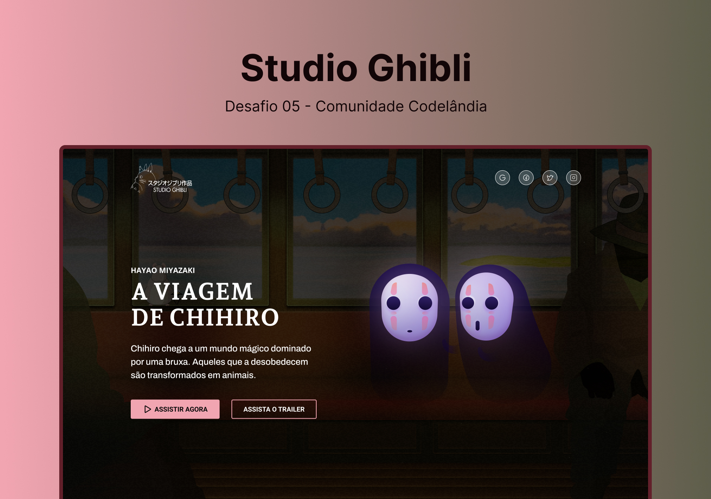

<h1 align="center">
  Studio Ghibli - Desafio 05
</h1>

  <a href="#rocket-sobre-o-desafio">Sobre o desafio</a>&nbsp;&nbsp;&nbsp;|&nbsp;&nbsp;&nbsp;
  <a href="#link-deploy">Deploy</a>&nbsp;&nbsp;&nbsp;|&nbsp;&nbsp;&nbsp;
  <a href="#art-layout">Layout</a>&nbsp;&nbsp;&nbsp;|&nbsp;&nbsp;&nbsp;
  <a href="#memo-licença">Licença</a>

 

## :rocket: Sobre o desafio

Reproduzir layout de uma página inspirada no Studio Ghibli, Inc. que é um estúdio de animação japonês baseado em Koganei, Tóquio.

 

## :link: Deploy
Para visualizar o resultado do projeto **[clique aqui](https://studio-ghibli-desafio-05-codelandia.vercel.app/)**

 

## :notebook: Nesse projeto foi utilizado

- **`Vite`**

- **`Animation e Keyframe`**

- **`Tailwind CSS`**
 

## :art: Layout

Para acessar o layout do projeto no figma **[clique aqui](https://www.figma.com/file/Yb9IBH56g7T1hdIyZ3BMNO/Desafios---Codel%C3%A2ndia?type=design&node-id=257087%3A1524&mode=design&t=1ijJO9jS3RagbuxG-1)**

Layout desenvolvido por [Iuri Code](https://www.instagram.com/iuricode/)

 

## :memo: Licença

Esse projeto está sob a licença MIT. Veja o arquivo [LICENSE](../LICENSE) para mais detalhes.

---

Feito por [Lucas Samuel](https://github.com/lucassamuel94)
